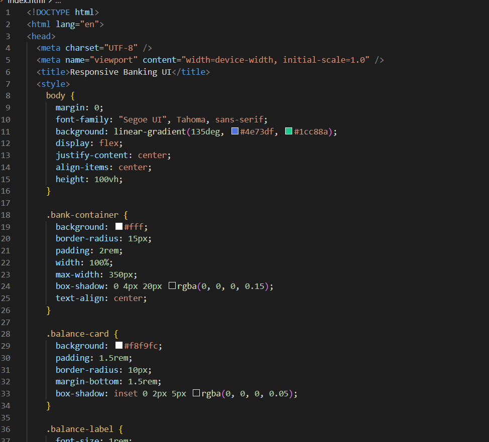
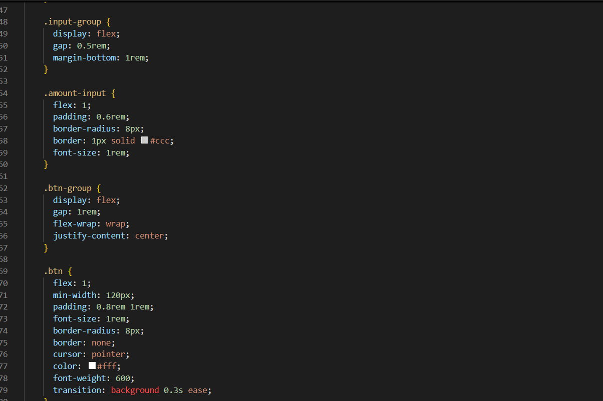
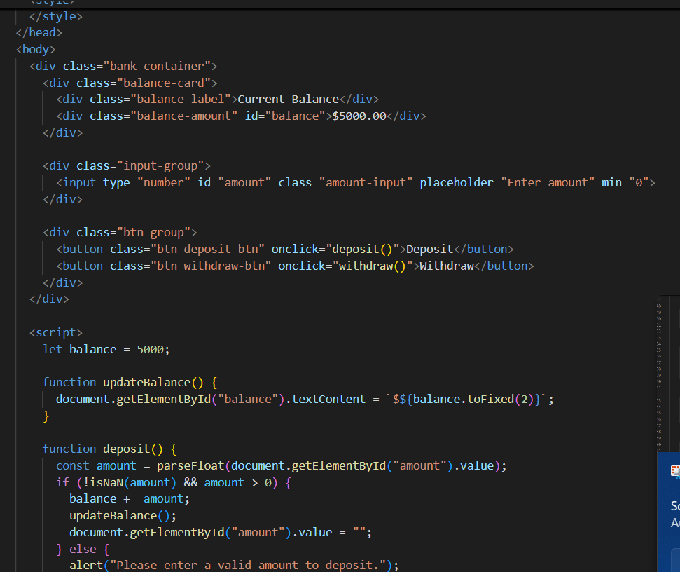
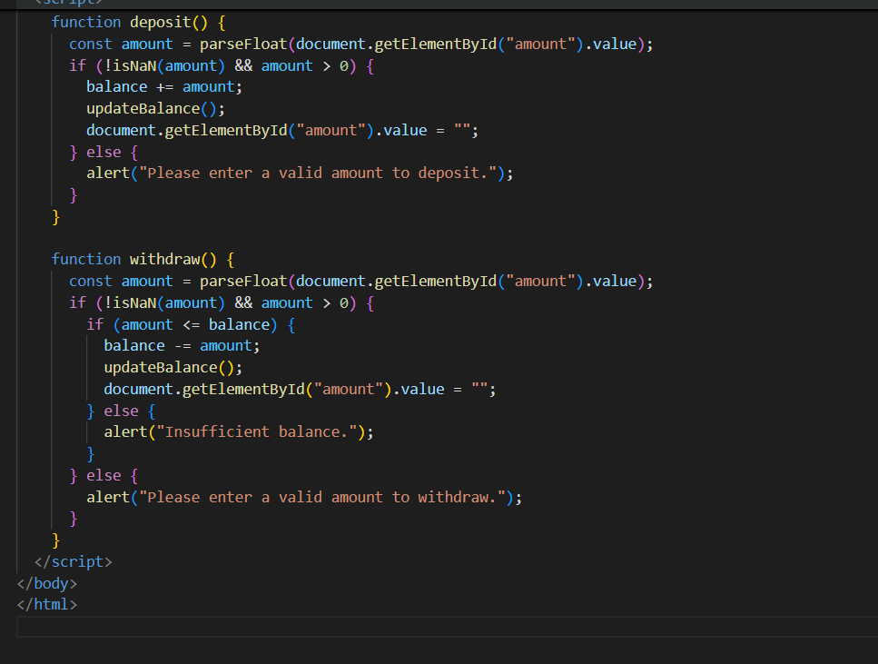
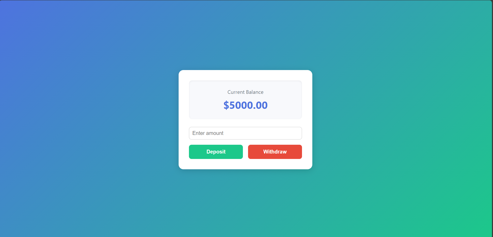
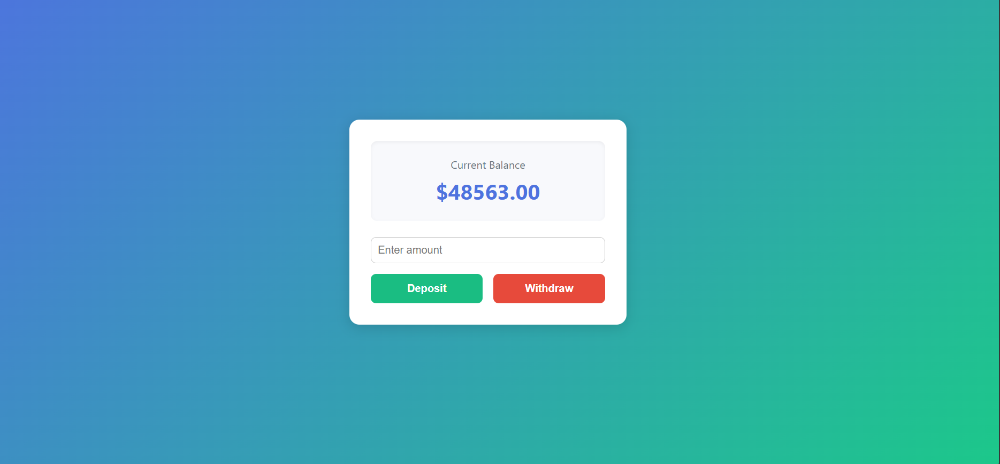

# 💰 Responsive Banking UI (Deposit & Withdrawal)

---

## 🎯 Aim
To design and develop a **responsive banking user interface** with a balance display, deposit, and withdrawal functionality using **HTML, CSS, and JavaScript**, allowing users to perform basic balance transactions in a clean and professional interface.

---

## 📜 Description
This project demonstrates a **simple banking web application** where users can:
- View their current account balance.
- Deposit money into the account.
- Withdraw money if sufficient balance is available.
- Experience a responsive and visually appealing interface that adapts to desktop, tablet, and mobile screens.

This is purely **frontend-based** and is ideal for learning UI design, styling, and DOM manipulation.

---

## 💻 Full Source Code

---

## 📷 Project UI Screenshot

---

## 📷 Output Screenshot (After Transactions)

---

## 📚 Learning Outcomes
By completing this project, you will:
1. Understand how to structure a responsive webpage using **HTML5**.
2. Learn how to style elements using **CSS3** (including responsive design).
3. Implement basic DOM manipulation and event handling in **JavaScript**.
4. Work with conditional statements and number formatting.
5. Gain experience in creating clean, user-friendly interfaces.
6. Understand how to validate user input before performing actions.

